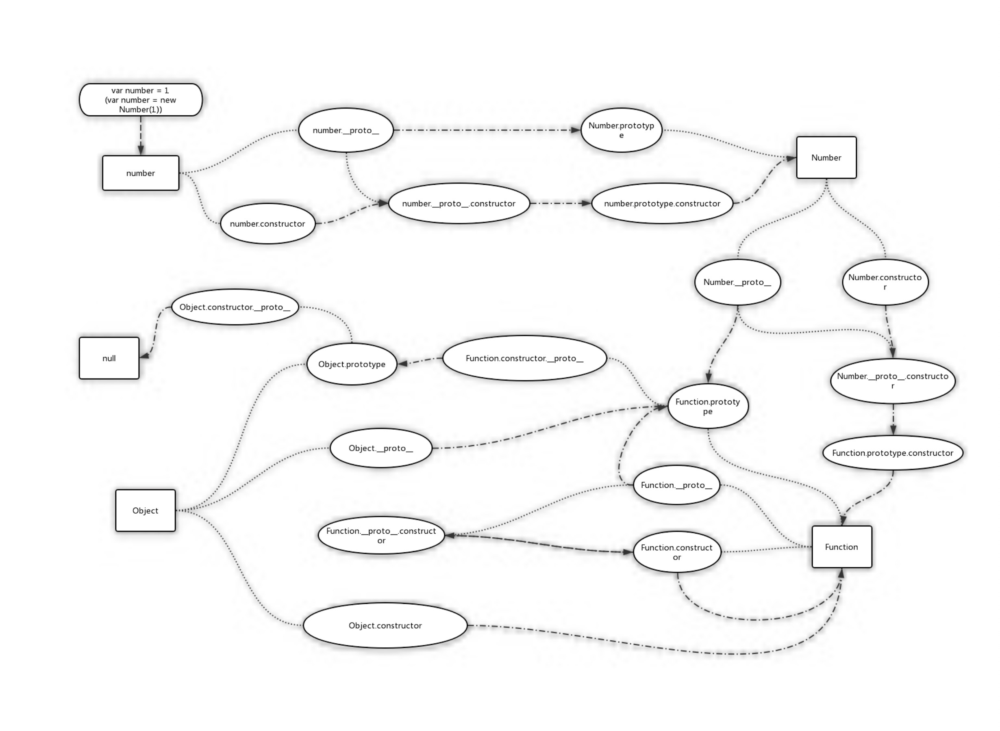

<!--
 * @Author: Kaiser
 * @Date: 2019-03-22 14:25:08
 * @Last Modified by: Kaiser
 * @Last Modified time: 2021-04-15 12:18:46
 * @Description: 原型链说明
 -->
# 原型链

## 原型链的图解



[点击此处查看详情](https://www.processon.com/view/link/5db5586be4b0ece7593eaf9b)

## 关于构造

以上图为例,其实constructor属性并非number(或是其他实例化对象)的自身属性,而是来自于其原型链number.__proto__.constructor=>Number.prototype.constructor=>Number,想要表达的意思是是有Number构造了number.

## 关于继承

继承包括属性和方法,在JavaScript中,继续通过向上查找,即其主要逻辑为自身若没有该属性(或是方法),便顺着原型链(__proto__=>prototype)向上查找,直到查到Object.prototype身上,若任未找到,便会返回undefined.

## 原型链相关的方法

### 原型链指向问题

所有应用类型都是有Function构建的, 故所有引用类型的__proto__都指向Function.prototype, 包括Object和Function, 与此同时Function.prototype.__proto__指向Object.prototype, 正式这个指向, 所有引用类型才能访问Object原型链上的方法, 而Object.prototype.__proto__指向null

### 修改原型链的指向

#### XX.prototype
```JavaScript
function Graph() {
  this.vertices = [];
  this.edges = [];
}

Graph.prototype = {
  addVertex: function(v){
    this.vertices.push(v);
  }
};

var g = new Graph();
// a.__proto__ => Graph.prototype
```

#### Object.create
```JavaScript
var a = {a: 1}; 
// a.__proto__ => Object.prototype

var b = Object.create(a);
// b.__proto__ => a

var c = Object.create(b);
// c.__proto__ => b, b.__proto__ => a

var d = Object.create(null);
// b.__proto__ => null
console.log(d.hasOwnProperty); // undefined, 因为d没有继承Object.prototype
```

#### class 
```JavaScript
class Polygon {
  constructor(height, width) {
    this.height = height;
    this.width = width;
  }
}

class Square extends Polygon {
  constructor(sideLength) {
    super(sideLength, sideLength);
  }
  get area() {
    return this.height * this.width;
  }
  set sideLength(newLength) {
    this.height = newLength;
    this.width = newLength;
  }
}

var square = new Square(2);
// square.__proto__ => Square.prototype
// Square.__proto__ => Polygon
true
```

### 遍历

#### for...in

for...in循环遍历对象自身以及继承的可枚举属性(不包含Symbol属性)

#### Object.keys()

Object.keys() 以数组的形式返回对象自身可枚举的属性(不包含Symbol属性和继承属性)

#### Object.values()

Object.values() 以数组的形式返回对象自身可枚举的属性的值(不包含Symbol属性和继承属性)

#### Object.entries()

Object.keys() 以数组的形式返回对象自身可枚举的属性和值(不包含Symbol属性和继承属性)

#### Object.getOwnpropertyNames()

Object.getOwnpropertyNames()该方法以数组的形式返回对象自身的属性(不包含Symbol属性,但包含不可枚举属性)

#### Object.getOwnPropertySymbols(obj)

Object.getOwnPropertySymbols(obj)该方法返回对象自身的Symbol属性(不包含继承属性)

#### Reflect.ownKeys(obj)
Reflect.ownKeys(obj)以数组的形式返回对象自身所有的属性(包含Symbol和不可枚举属性)

#### 以上的 5 种方法遍历对象的键名，都遵守同样的属性遍历的次序规则。
 - 首先遍历所有数值键，按照数值升序排列。
 - 其次遍历所有字符串键，按照加入时间升序排列。
 - 最后遍历所有 Symbol 键，按照加入时间升序排列。

