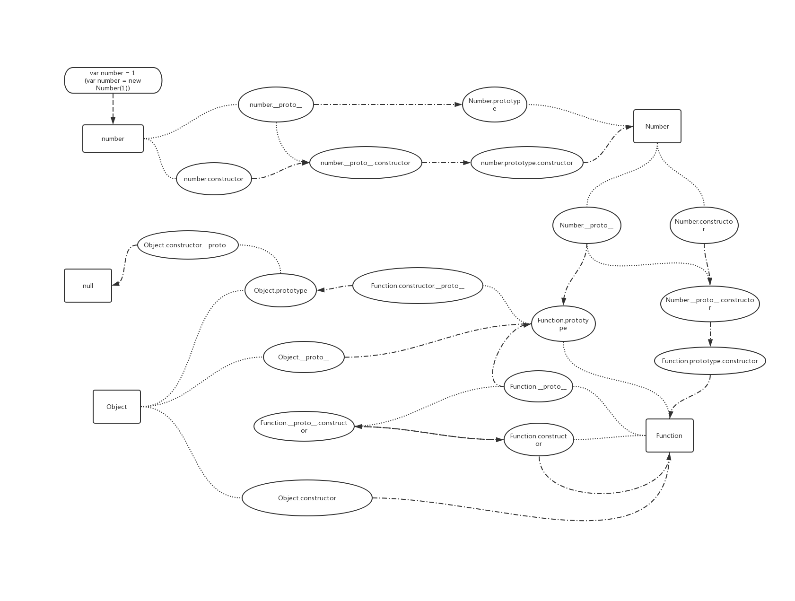

<!--
 * @Author: Kaiser
 * @Date: 2019-03-22 14:25:08
 * @Last Modified by: Kaiser
 * @Last Modified time: 2019-10-27 22:27:00
 * @Description: 原型链说明
 -->
# 原型链

## 原型链的图解

## 关于构造

在下方代码片段中,声明了 A 函数,然后用 A new 了一个实例 a,a.constructor === A,理解为 a 由 A 构造而成,其实不然,a 本身并不拥有 constructor 属性,但是 a.**proto** === A.prototype,a 上没有,但是 A.prototype 上有,而 constructor 正是 A.prototype 拥有的,如同 add 方法一般

## 关于继承

1.原型链的建立,如果上述例子中,var a = new A(),A 函数会运行并返回新构建的对象与 this 绑定,同时将 a 与 A 的原型链对象关联  
2.原型链绑定后,即可沿着原型链上查找属性,即继承了属性
